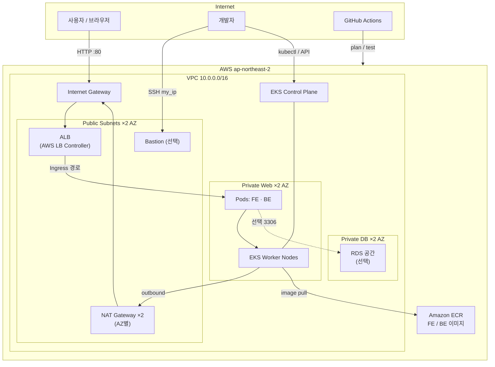
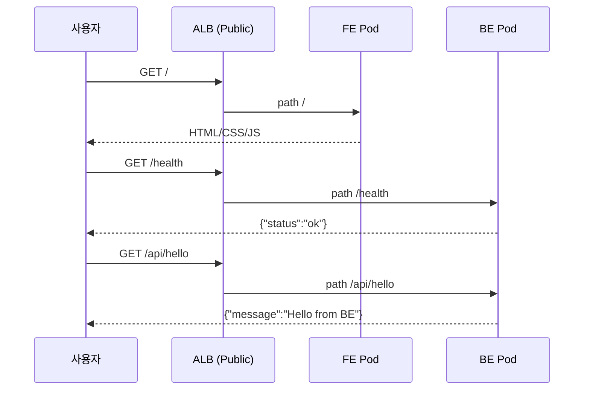
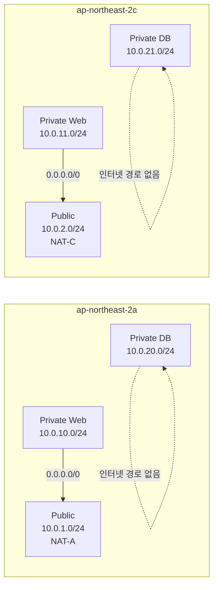
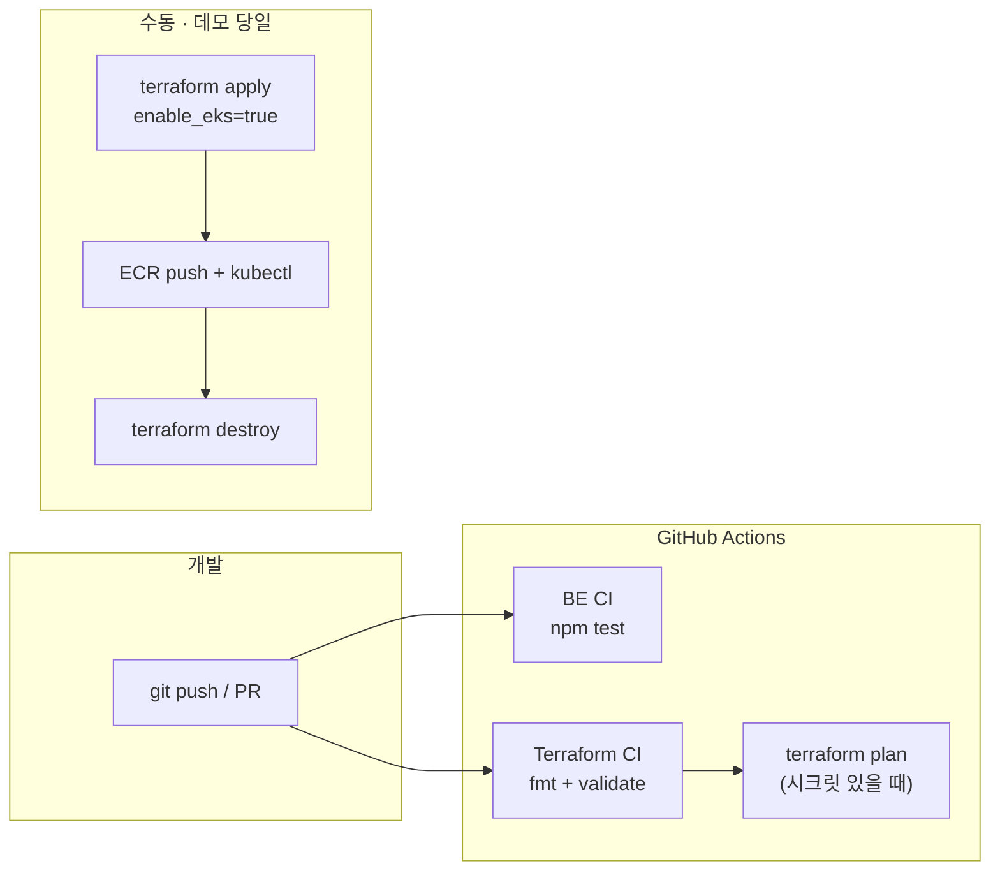
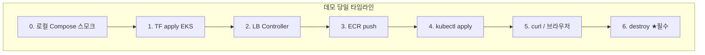

# IaC 기반 클라우드 네트워크 자동화 및 CI/CD 파이프라인

**Terraform**으로 3-Tier 보안 네트워크를 코드화하고, **Amazon EKS** 위에 FE/BE를 올려 **ALB Ingress**로 서비스하며, **GitHub Actions**로 검증 파이프라인을 돌리는 포트폴리오 프로젝트입니다.

| 항목 | 내용 |
|------|------|
| 리전 | `ap-northeast-2` (서울) |
| IaC | Terraform ≥ 1.5 |
| 앱 | `FE/` (Nginx 정적) · `BE/` (Node.js Express) |
| 오케스트레이션 | Amazon EKS (선택 활성화) |
| CI | GitHub Actions (`fmt` / `validate` / `plan` · BE test) |
| 저장소 | [github.com/jinhgit/cloud-infra-cicd](https://github.com/jinhgit/cloud-infra-cicd) |

---

## 목차

1. [한눈에 보는 아키텍처](#한눈에-보는-아키텍처)
2. [데모 시나리오](#데모-시나리오)
3. [빠른 시작](#빠른-시작)
4. [디렉터리 구조](#디렉터리-구조)
5. [진행 단계](#진행-단계)
6. [프로젝트 문서](#프로젝트-문서)
7. [보안·비용](#보안비용)

---

## 한눈에 보는 아키텍처

### 전체 구성 (권장 A — EKS)



### 트래픽 경로 (런타임)



| 경로 | 대상 | 용도 |
|------|------|------|
| `/` | FE Service | 데모 UI |
| `/health` | BE Service | API 헬스 (ALB·FE 호출) |
| `/api/*` | BE Service | REST API |
| FE `/healthz` | FE 컨테이너 | K8s probe (클러스터 내부) |

### 네트워크 계층 (Stage 1)



| 항목 | 값 |
|------|-----|
| VPC | `10.0.0.0/16` |
| 서브넷 | **6** (Public 2 + Web 2 + DB 2) |
| NAT / EIP | **AZ당 1 = 2** |
| Route Table | **5** (Public 1 + Web AZ별 2 + DB AZ별 2) |
| SG | ALB · Web · Bastion · RDS |

ASCII 상세도는 [docs/architecture.md](docs/architecture.md) 참고.

### CI/CD 흐름



- **CI는 apply 하지 않음** (과금·안전).  
- 설정: [docs/CI.md](docs/CI.md)

---

## 데모 시나리오

포트폴리오/발표용으로 **두 가지 시나리오**를 준비했습니다.

### 시나리오 A — 로컬 앱 데모 (비용 0, 5분)

**증명 포인트:** FE/BE same-origin 연동, Docker 이미지, 헬스 API

```bash
# 1) 저장소 클론 후
docker compose up --build

# 2) 브라우저
open http://localhost:8080
# 또는
curl -sS http://localhost:8080/health
curl -sS http://localhost:8080/api/hello

# 3) 종료
docker compose down
```

| 확인 | 기대 |
|------|------|
| UI Backend Health | OK (200) |
| UI GET /api/hello | OK (200) |
| `BE` `npm test` | 3 passed |


---

### 시나리오 B — AWS EKS E2E 데모 (과금 있음, 2.5~4시간)

**증명 포인트:** 3-Tier 네트워크 · EKS · ALB Ingress · ECR · destroy 수명주기

> **전체 명령·체크박스:** [docs/EKS_E2E_CHECKLIST.md](docs/EKS_E2E_CHECKLIST.md)  
> 아래는 발표용 **요약 스크립트**입니다.

#### B-1. 인프라 기동

```bash
cd terraform
# terraform.tfvars: my_ip = "현재공인IP/32", enable_eks = true
terraform init
terraform plan -out=tfplan
terraform apply tfplan

export AWS_REGION=ap-northeast-2
export CLUSTER_NAME=$(terraform output -raw eks_cluster_name)
aws eks update-kubeconfig --region "$AWS_REGION" --name "$CLUSTER_NAME"
kubectl get nodes   # Ready ≥ 2
```

#### B-2. Controller · 이미지 · 앱

```bash
# LB Controller: k8s/aws-load-balancer-controller/install.md
# ECR 로그인 후
docker build -t "$(terraform output -json ecr_repository_urls | jq -r .be):latest" ../BE
docker build -t "$(terraform output -json ecr_repository_urls | jq -r .fe):latest" ../FE
docker push ...   # E2E 체크리스트 §3 참고

# 매니페스트 IMAGE_* 치환 후
kubectl apply -f k8s/namespace.yaml
kubectl apply -f k8s/be/ -f k8s/fe/ -f k8s/ingress/
kubectl -n cloud-infra get ingress cloud-infra   # ADDRESS = ALB DNS
```

#### B-3. 성공 판정 (발표 시 보여줄 것)

```bash
export ALB_DNS=$(kubectl -n cloud-infra get ingress cloud-infra \
  -o jsonpath='{.status.loadBalancer.ingress[0].hostname}')

curl -sS -o /dev/null -w "%{http_code}\n" "http://${ALB_DNS}/"          # 200
curl -sS "http://${ALB_DNS}/health"                                      # status ok
curl -sS "http://${ALB_DNS}/api/hello"                                   # Hello from BE
# 브라우저: http://$ALB_DNS/
```

| 데모 체크 | 통과 기준 |
|-----------|-----------|
| 노드 | Ready ≥ 2, Private 서브넷 |
| Ingress | ALB DNS 할당 |
| `/` | FE HTML 200 |
| `/health`, `/api/hello` | BE JSON 200 |
| 보안 스토리 | 노드 공인 직접 접속 없음, Bastion은 `my_ip`만 (구현 시) |

#### B-4. 비용 차단 (발표 직후 필수)

```bash
kubectl delete -f k8s/ingress/ --ignore-not-found   # ALB 정리 대기
helm uninstall aws-load-balancer-controller -n kube-system || true
cd terraform && terraform destroy -auto-approve
# NAT / EKS / ALB 잔존 여부 콘솔·CLI 재확인 (E2E 체크리스트 §6)
```



---

### 시나리오 비교

| | A. 로컬 | B. AWS EKS |
|--|---------|------------|
| 비용 | 없음 | NAT·EKS·노드·ALB (시간 과금) |
| 시간 | ~5분 | 2.5~4시간 |
| 증명 | 앱·Docker·API | 네트워크+EKS+Ingress+수명주기 |
| CI 연관 | `BE CI` 로컬과 동일 테스트 | `Terraform CI` plan 과 코드 동일 |

---

## 빠른 시작

### 필수 도구

- AWS CLI, Terraform ≥ 1.5, Git  
- 앱/EKS 데모: Docker, kubectl, Helm  

### 로컬 앱 (시나리오 A)

```bash
docker compose up --build
# http://localhost:8080
```

### Terraform (네트워크만, EKS 끔)

```bash
cd terraform
cp terraform.tfvars.example terraform.tfvars
# my_ip 수정 / enable_eks = false 유지
terraform init
terraform plan
terraform apply
# 끝나면
terraform destroy
```

런북: [docs/STAGE_1_APPLY.md](docs/STAGE_1_APPLY.md)

### CI 로컬 동일 검사

```bash
cd BE && npm ci && npm test
cd terraform && terraform fmt -check -recursive \
  && terraform init -backend=false && terraform validate
```

---

## 디렉터리 구조

```
cloud-infra-cicd/
├── README.md                 # 본 문서 (다이어그램 · 데모)
├── docker-compose.yml        # 로컬 FE+BE
├── FE/                       # 프론트 (Nginx + 정적)
├── BE/                       # 백엔드 (Express)
├── k8s/                      # EKS 매니페스트 · Ingress
├── terraform/                # VPC/NAT/SG + 선택 EKS/ECR
├── docs/                     # PRD · 명세 · E2E 체크리스트 · CI
└── .github/workflows/        # BE CI · Terraform CI
```

---

## 진행 단계

| 단계 | 목표 | 상태 |
|------|------|------|
| 1 | Terraform 네트워크 (NAT 2 · RT 5 · SG) | ✅ 코드 완료 (필요 시 apply/destroy) |
| 2 | Bastion 등 (레거시 EC2 웹은 P2) | ⚪ 선택 |
| 3 | GitHub Actions fmt/validate/plan + BE test | ✅ 골격·시크릿 plan 검증 |
| 4 | EKS + Ingress + ECR 데모 | 🟡 코드·체크리스트 준비, 당일 apply |

상세: [docs/PRD.md](docs/PRD.md)

---

## 프로젝트 문서

| 문서 | 설명 |
|------|------|
| [PRD](docs/PRD.md) | 목표, 범위, EKS §14 |
| [기능 명세서](docs/FUNCTIONAL_SPEC.md) | 기능 ID · 수락 기준 |
| [architecture](docs/architecture.md) | 네트워크 상세 |
| [STAGE_1_APPLY](docs/STAGE_1_APPLY.md) | 네트워크 apply 런북 |
| [EKS_DESIGN](docs/EKS_DESIGN.md) | EKS 설계 |
| [**EKS_E2E_CHECKLIST**](docs/EKS_E2E_CHECKLIST.md) | **데모 당일 전체 명령** |
| [CI](docs/CI.md) | Actions · Secrets |
| [k8s README](k8s/README.md) | 매니페스트 |

---

## 보안·비용

### 보안

- `terraform.tfvars` / `*.tfstate` / `.env` → Git 제외  
- Bastion·EKS API: `my_ip` 제한 권장  
- CI: Secrets 또는 **OIDC** ([docs/CI.md](docs/CI.md))  
- 최소 권한 SG (ALB → 워크로드, DB → Web SG만)

### 비용

| 리소스 | 주의 |
|--------|------|
| NAT ×2 | 상시 과금 |
| EKS 컨트롤 플레인 | **클러스터 유지 시간** 과금 (노드 0이어도) |
| 노드 EC2 · ALB | 데모 중 과금 |
| **대응** | 데모 후 **즉시 destroy** + 잔존 ALB/NAT 점검 |

---

## 학습 포인트

- AWS 3-Tier · 2-AZ 네트워크 설계  
- Terraform IaC · plan/apply/destroy 수명주기  
- EKS · IRSA · ALB Ingress  
- 컨테이너 FE/BE · ECR  
- GitHub Actions CI  

## 참고 링크

- [Terraform](https://www.terraform.io/docs) · [AWS VPC](https://docs.aws.amazon.com/vpc/) · [EKS](https://docs.aws.amazon.com/eks/) · [GitHub Actions](https://docs.github.com/actions)

---

**마지막 업데이트:** 2026-07-17  
**버전:** v0.3.0 — README 아키텍처 다이어그램 · 데모 시나리오 A/B
