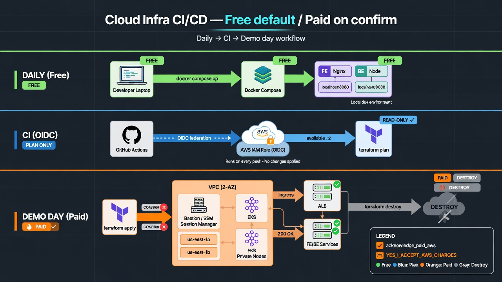
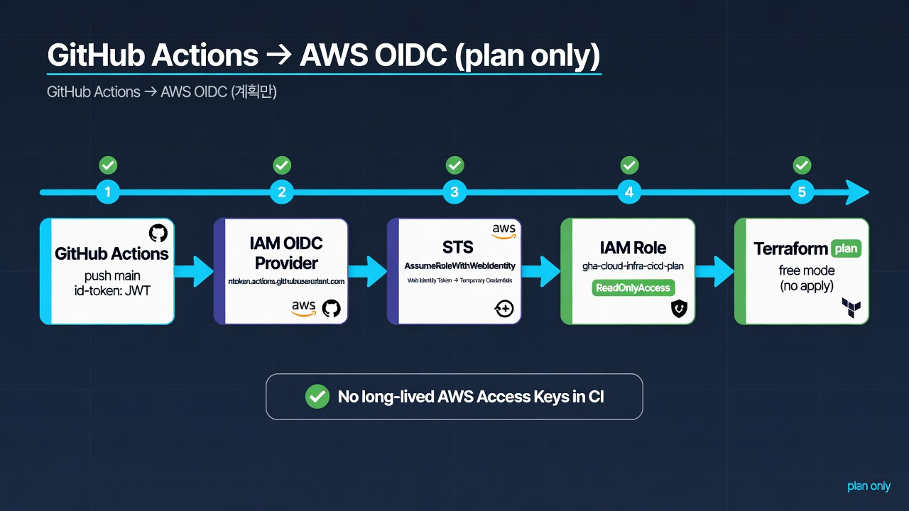
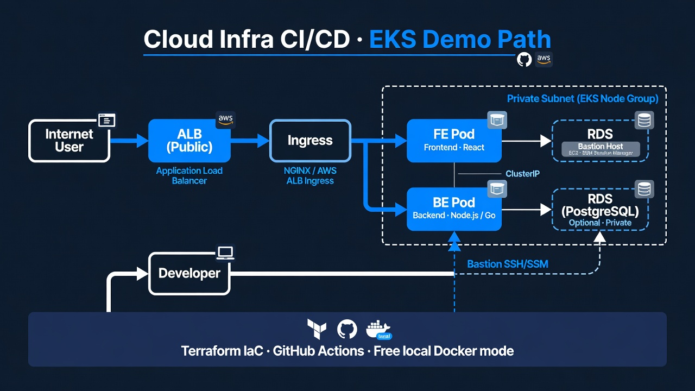
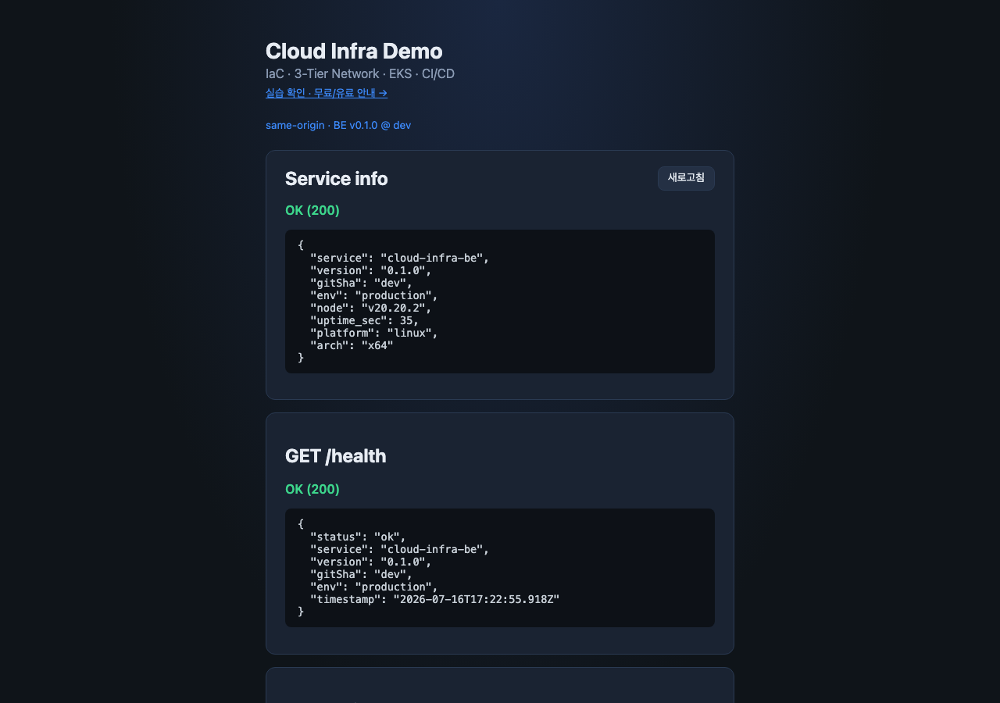
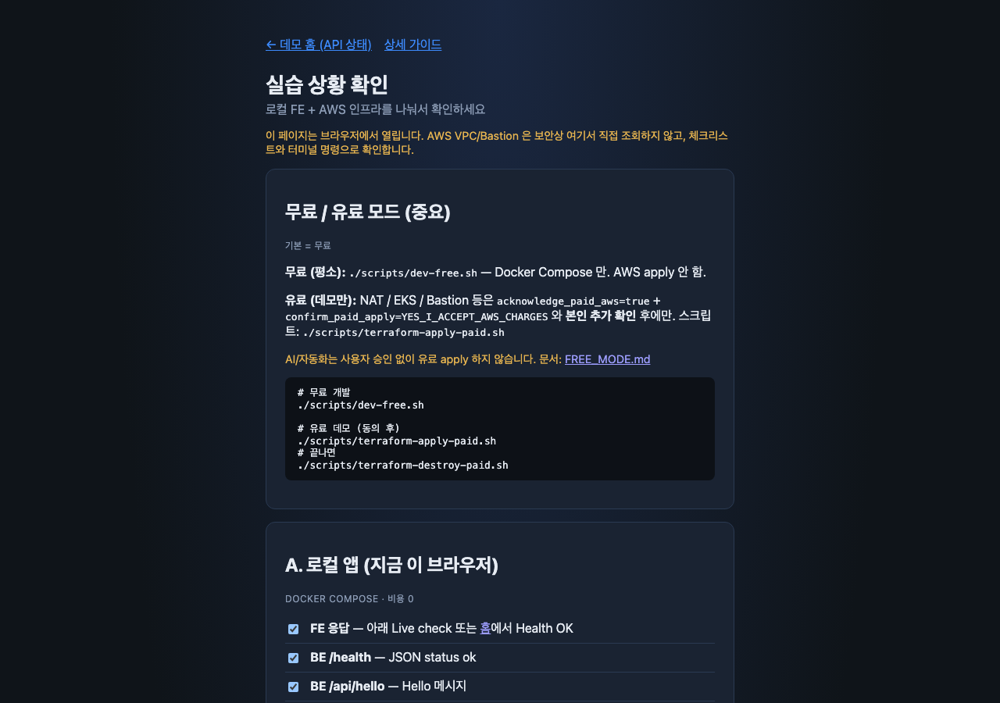
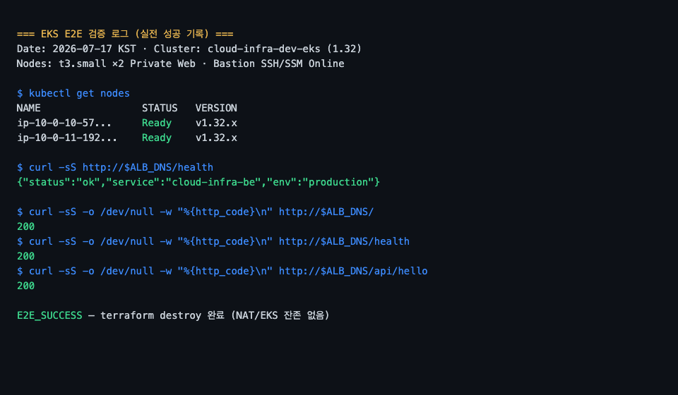

# 데모 자료 세트 (포트폴리오용)

채용관·발표용 **시각자료 + 설명**을 한곳에 모았습니다.  
(현재 AWS 인프라는 **destroy** 상태 — 과금 없음. 재현 시 유료 동의 필요.)

| 항목 | 상태 |
|------|------|
| 로컬 데모 | `./scripts/dev-free.sh` → http://localhost:8080 |
| EKS E2E | 실전 성공 이력 (ALB 200) 후 destroy |
| CI | GitHub OIDC → `terraform plan` (main only) |
| 장기 키 | GitHub Access Key Secret **삭제 완료** |

---

## 3줄 스토리 (발표 고정)

1. **문제:** 콘솔 수동 인프라 · CI 장기 Access Key · 상시 NAT/EKS 과금  
2. **설계:** Terraform 3-Tier + Bastion/SSM + EKS(ALB) · 무료 Docker · 유료 이중 확인 · OIDC plan  
3. **결과:** ALB 200 E2E → destroy · OIDC plan 성공 · Secrets 키 제거  

상세 복붙: [RESUME_ONE_PAGER.md](../RESUME_ONE_PAGER.md)

---

## 스크린샷 · 다이어그램 목록

| # | 파일 | 한 줄 설명 | 면접에서 말할 포인트 |
|---|------|------------|----------------------|
| 1 | [01-local-home.png](screenshots/01-local-home.png) | 로컬 데모 홈 UI | 평소 **과금 0** — FE/BE same-origin |
| 2 | [02-local-lab.png](screenshots/02-local-lab.png) | lab — 무료/유료 안내 | 학습 경로·체크리스트 UI |
| 3 | [03-eks-e2e-terminal.png](screenshots/03-eks-e2e-terminal.png) | EKS curl 200 터미널 | **실전 E2E 증거** (라이브 URL 없음 = destroy) |
| 4 | [04-architecture-path.jpg](screenshots/04-architecture-path.jpg) | Internet→ALB→Pods | Private 노드 + Public ALB 경로 |
| 5 | [05-oidc-flow.jpg](screenshots/05-oidc-flow.jpg) | GitHub→OIDC→Role→plan | **장기 키 없이** plan only |
| 6 | [06-modes-overview.jpg](screenshots/06-modes-overview.jpg) | Free / CI / Paid 3모드 | 비용 설계 한 장 요약 |
| — | [03-eks-e2e-curl-evidence.txt](screenshots/03-eks-e2e-curl-evidence.txt) | curl 로그 텍스트 | 스크린샷 보조 증거 |

---

## 미리보기 (설명 포함)

### A. 운영 모드 한눈에 (표지 추천)

**무엇을 보여주나:** 일상(Free) · CI(OIDC plan) · 데모 당일(Paid → destroy) 세 레인을 구분.



**설명:**  
포트폴리오에서 “항상 클라우드가 떠 있다”고 오해받지 않도록, **기본은 로컬·CI는 plan·유료는 짧은 창**임을 한 장으로 고정합니다.  
유료 레인의 입구는 `acknowledge_paid_aws=true` + `confirm_paid_apply=YES_I_ACCEPT_AWS_CHARGES` 입니다.

---

### B. OIDC 인증 흐름 (보안 스토리)

**무엇을 보여주나:** GitHub Actions JWT → IAM OIDC Provider → `AssumeRoleWithWebIdentity` → plan Role → `terraform plan` only.



**설명:**  
- Secret 은 `AWS_ROLE_ARN` 만 사용 (Access Key Secret 삭제).  
- trust 는 **main 브랜치** + `aud=sts.amazonaws.com` 으로 제한.  
- GitHub `sub` 이 `repo:owner@id/repo@id:ref:...` 형태일 수 있어 CloudTrail로 확인 후 StringLike 를 맞춤 (실전 트러블슈팅).

---

### C. 트래픽 경로 (클라우드 아키텍처)

**무엇을 보여주나:** 사용자 → ALB(Public) → Ingress → FE/BE Pod(Private 노드).



**설명:**  
워커는 Private Web 서브넷, 인터넷 진입은 ALB만. 노드 아웃바운드는 NAT.  
Bastion/SSM 은 운영 점프·디버그 스토리용 (상시 필수는 아님).

---

### D. 로컬 UI (지금 바로 재현)

**무엇을 보여주나:** `/health`, `/api/hello`, `/api/info` 가 같은 origin 으로 동작하는 데모 홈.





**설명:**  
채용관·화상 면접에서 **라이브 클라우드 없이** 보여줄 수 있는 화면입니다.  
`lab.html` 은 무료/유료 경계와 체크리스트를 사용자에게 명시합니다.

```bash
./scripts/dev-free.sh
# http://localhost:8080
# http://localhost:8080/lab.html
```

---

### E. EKS E2E 실전 증거 (과거 성공 · 이후 destroy)

**무엇을 보여주나:** ALB DNS 로 `/`, `/health`, `/api/hello` 가 200 인 curl 기록.



**설명:**  
“띄워 본 적 있다”를 터미널 증거로 남기고, **그 다음 destroy** 한 것이 비용·운영 메시지입니다.  
라이브 URL이 없는 이유 = 의도적 설계.

상세: [DEMO_E2E_RESULT.md](../DEMO_E2E_RESULT.md)

---

## 60초 발표 스크립트 (권장 순서)

| 초 | 화면 | 말 |
|----|------|-----|
| 0–10 | `06-modes-overview` | 세 모드: 평소 무료, CI는 plan, 데모만 유료 |
| 10–25 | `04-architecture-path` | 2-AZ 3-Tier, Private 노드, ALB Ingress |
| 25–40 | `03-eks-e2e-terminal` | 실제로 200 찍고 destroy 했다 |
| 40–55 | `05-oidc-flow` | 장기 키 제거, OIDC, main-only trust |
| 55–60 | `01-local-home` | 지금 당장 로컬로 재현 가능 |

### 한 줄 클로징

> “재현 가능한 IaC, 증명한 E2E, 그리고 키·비용을 줄인 운영까지 한 사이클을 닫았습니다.”

---

## 재현 명령

```bash
# 로컬 (지금 바로 · 과금 0)
./scripts/dev-free.sh

# EKS E2E (유료 — 사용자 이중 확인 후)
# docs/EKS_E2E_CHECKLIST.md
# ./scripts/terraform-apply-paid.sh
# … 데모 후
# ./scripts/terraform-destroy-paid.sh
```

---

## 관련 문서

| 문서 | 내용 |
|------|------|
| [RESUME_ONE_PAGER.md](../RESUME_ONE_PAGER.md) | 3줄 요약 · 이력서 문장 |
| [NOTION_GUIDE.md](../NOTION_GUIDE.md) | 노션 붙여넣기 |
| [DEMO_E2E_RESULT.md](../DEMO_E2E_RESULT.md) | E2E 결과 요약 |
| [OIDC_SETUP.md](../OIDC_SETUP.md) | OIDC 실전 가이드 |
| [FREE_MODE.md](../FREE_MODE.md) | 무료/유료 경계 |
| [INTERVIEW_QA_LESSONS.md](../INTERVIEW_QA_LESSONS.md) | 면접 Q&A |
